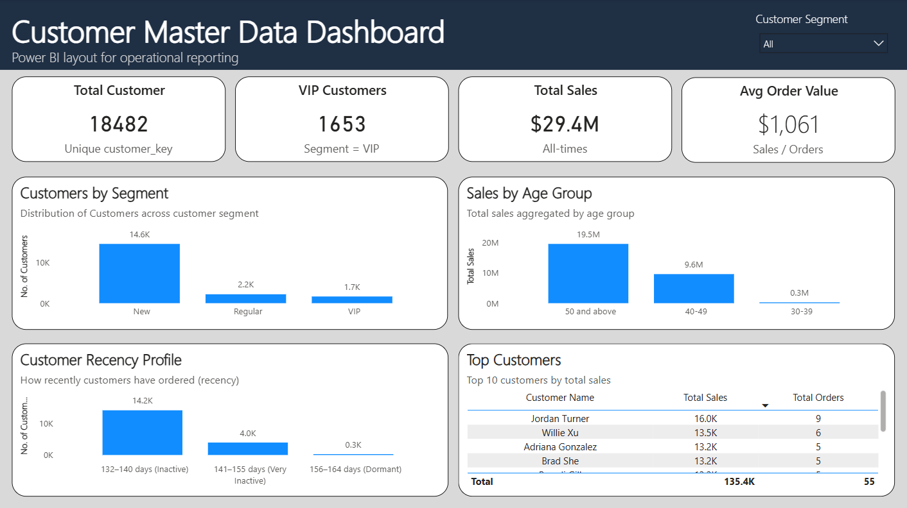
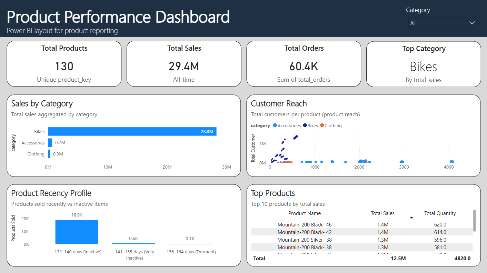
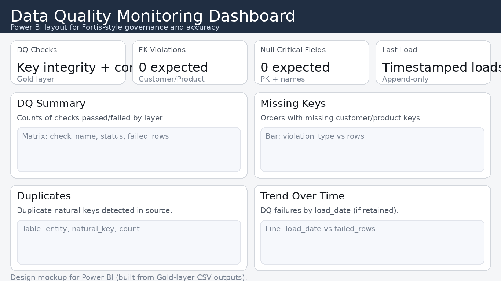

# Fortis-Style Python Data Analytics Project

## Overview
This project demonstrates how **clean, governed data** can be analysed and reported using Python to support operational and commercial decision-making.

The analysis is intentionally positioned to reflect the type of **day-to-day reporting and insight generation** expected from an entry-level Data Analyst at Fortis.

Rather than exploratory or academic analysis, the focus is on:
- Data reliability
- Repeatable logic
- Clear business outputs

---

## Power BI Dashboard Preview (Gold Consumption)
These dashboards illustrate how the same Gold outputs consumed by Python can be surfaced in Power BI for operational reporting.

---

## Business Context
Operational teams require timely, accurate insights derived from trusted data sources to:
- Monitor performance
- Identify trends
- Support planning and reporting

This project simulates a typical workflow where **business-ready tables** (for example, from a data warehouse Gold layer) are analysed using Python to produce charts and summary outputs for stakeholders.

---

## Data Sources
- Structured CSV datasets representing cleaned and conformed business data
- Schemas are assumed stable and suitable for reporting
- Data aligns conceptually with customer and product master data maintained upstream

---

## Analytical Objectives
The analysis focuses on:
- Summarising key metrics
- Identifying patterns and trends
- Producing clear, interpretable charts
- Generating outputs suitable for reporting or dashboarding

All analysis steps are designed to be **reproducible** and **maintainable**, reflecting real-world business expectations.

---

## Data Preparation
Key preparation steps include:
- Handling missing or inconsistent values
- Validating schema assumptions
- Ensuring consistent data types
- Verifying metric calculations

These steps mirror the responsibility of ensuring analytical outputs are based on reliable inputs.

---

## Reporting Outputs
The final outputs of this project are designed for business consumption:
- Aggregated summary tables
- Clear visualisations (charts and graphs)
- Interpretable metrics suitable for management reporting

Each output answers a defined business question and could be shared directly with stakeholders or integrated into dashboards.

---

## Tools & Technologies
- Python
- Pandas for data manipulation
- Matplotlib / Seaborn for visualisation
- Jupyter Notebooks for transparent, step-by-step analysis

---

## Relationship to the SQL Data Warehouse
This project is designed to **consume outputs from a SQL data warehouse Gold layer**:
- SQL ensures data accuracy, consistency, and governance
- Python enables flexible analysis and reporting

Together, they demonstrate the ability to move seamlessly between SQL-based data preparation and Python-based analysis.

---

## How This Aligns With the Fortis Data Analyst Role
This project demonstrates the ability to:
- Clean and analyse structured data
- Create basic charts and visual reports
- Support trend analysis and insights
- Work with governed datasets
- Translate data into business-relevant outputs

---

## Next Steps
This analysis can be extended into:
- Automated reporting
- Dashboarding (Power BI or similar tools)
- Integration with live warehouse tables

The current structure provides a solid foundation for ongoing operational analytics.
